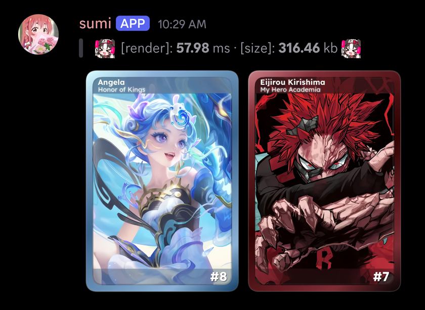

<div align="center">
  

  <h2>Image renderer for @Blair!</h2>

  

 

</div>

In upcoming versions, sumi would most likely support profile card creation and top.gg/release card banner previews.

## Winslop setup

Download and run rustup-init.exe from <https://rustup.rs/>

> [!IMPORTANT]
> make sure you install the c/c++ build tools (tick the visual studio build tools checkbox) when setting up rust, as sumi requires a C compiler to build.

> [!NOTE]
> if you are contributing to sumi, make sure your code passes [clippy and fmt checks](https://github.com/blairtcg/sumi/blob/main/.github/workflows/clippy.yml), just is also recommended <kbd>cargo install just</kbd>

<div align="center">




</div>

## Benches

| Component | Specification |
| :--- | :--- |
| **CPU** | AMD EPYC 9V74 (2 Cores / 4 vCPUs, Zen 4) |
| **RAM** | 15 GiB |
| **OS** | Ubuntu 24.04.5 LTS |
| **Payload** | 1490×1080 WebP (~391 KB / response) |

### Results

| Profile | Duration | RPS | Throughput | Avg Latency | Stdev | Max Latency |
| :--- | :--- | :--- | :--- | :--- | :--- | :--- |
| **4 Threads / 4 Conns** | 10s | **41.58** | 16.27 MB/s | 95.96 ms | 7.80 ms | 173.38 ms |
| **4 Threads / 100 Conns** | 30s | **42.10** | 16.45 MB/s | 2.28 s | 358.28 ms | 2.45 s |

<details>
<summary>raw wrk</summary>

```text
Running 10s test @ http://localhost:6767
  4 threads and 4 connections
  Thread Stats   Avg      Stdev     Max   +/- Stdev
    Latency    95.96ms    7.80ms 173.38ms   87.38%
    Req/Sec    10.37      2.26    20.00     94.21%
  420 requests in 10.10s, 164.32MB read
Requests/sec:     41.58
Transfer/sec:     16.27MB

Running 30s test @ http://localhost:6767
  4 threads and 100 connections
  Thread Stats   Avg      Stdev     Max   +/- Stdev
    Latency     2.28s   358.28ms   2.45s    93.69%
    Req/Sec    32.73     15.95    60.00     65.17%
  1267 requests in 30.10s, 495.14MB read
Requests/sec:     42.10
Transfer/sec:     16.45MB
```
</details>

## Build sumi

```powershell
just build
```

Build binary with release flags

## Start sumi

Run binary in background with logs

Sumi service will run on **port 8888** locally if env isnt set.

You would need auth key if running sumi on separate machine.

```powershell
just start
```

## Kill sumi

```powershell
just kill
```

------- to list running renderer processes

```powershell
just list
```
